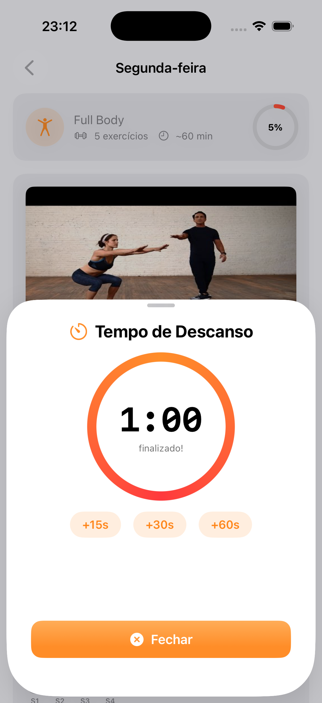
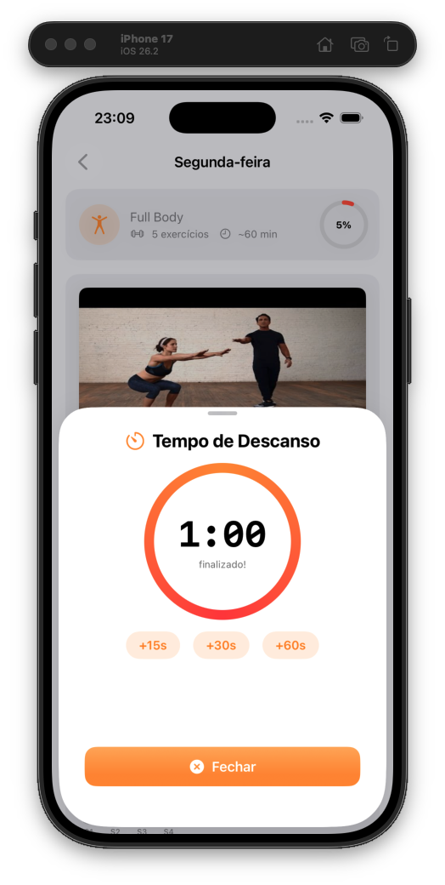

<h1 align="center">🔥 Queima Pança</h1>

<p align="center">
  <strong>Seu app fitness pessoal para queimar gordura e acompanhar seus treinos semanais.</strong>
</p>

<p align="center">
  
  
  
  
  
</p>

---

## 📱 Sobre o Projeto

**Queima Pança** é um aplicativo iOS nativo focado em ajudar você a seguir uma rotina semanal de treinos com foco em **queima de gordura abdominal**. O app organiza seus treinos diários, permite marcar séries concluídas em tempo real, e inclui um timer de descanso integrado com visual circular animado.

### ✨ Funcionalidades

- 🗓️ **Plano semanal completo** — 5 dias de treino organizados por grupo muscular
- 💪 **Tracker de séries** — Marque cada série concluída com visual interativo
- ⏱️ **Timer de descanso** — Timer circular animado com botões de +15s, +30s, +60s
- 📊 **Progresso semanal** — Anel de progresso mostrando seu avanço na semana
- 🎥 **Vídeos demonstrativos** — Thumbnails do YouTube com link direto para cada exercício
- 🏃 **Seção de cardio** — Recomendações de cardio para cada dia
- 🌤️ **Saudação dinâmica** — Bom dia / Boa tarde / Boa noite automático
- 📳 **Feedback háptico** — Vibração ao completar o tempo de descanso

---

## 🏗️ Arquitetura

O projeto segue a arquitetura **MVVM (Model-View-ViewModel)** com separação clara de responsabilidades e injeção de dependências via **Repository Pattern**.

```
Queima Pança/
├── 📦 Model/
│   ├── MuscleGroup.swift          # Enum de grupos musculares com ícones
│   ├── Exercise.swift             # Modelo de exercício (Hashable, Identifiable)
│   └── DayWorkout.swift           # Modelo de treino diário com computed props
│
├── 🔧 Service/
│   └── WorkoutRepository.swift    # Protocol + LocalRepository (dados do plano)
│
├── 🧠 ViewModel/
│   ├── WorkoutViewModel.swift     # Lógica de treinos, progresso e tracking
│   └── RestTimerViewModel.swift   # Timer com Combine, haptic feedback
│
├── 🎨 View/
│   ├── Theme/
│   │   └── AppTheme.swift         # Design system (cores, gradientes, modifiers)
│   ├── Components/
│   │   ├── ProgressRing.swift     # Anel de progresso circular animado
│   │   ├── WorkoutCard.swift      # Card de treino com ícone e progresso
│   │   └── ExerciseCard.swift     # Card de exercício com thumbnail e tracker
│   ├── ContentView.swift          # Tela Home (saudação, progresso, lista)
│   ├── WorkoutDetailView.swift    # Detalhe do treino com exercícios e cardio
│   └── RestTimerView.swift        # Modal do timer circular de descanso
│
└── Queima_Panc_aApp.swift         # Entry point do app
```

### Fluxo de dados

```
┌──────────────┐     ┌────────────────────┐     ┌──────────────┐
│  Repository  │────▶│    ViewModel       │────▶│    Views     │
│  (Dados)     │     │  (Lógica/Estado)   │◀────│  (SwiftUI)   │
└──────────────┘     └────────────────────┘     └──────────────┘
```

---

## 🛠️ Tech Stack

| Tecnologia | Uso |
|-----------|-----|
| **Swift 5.9+** | Linguagem principal |
| **SwiftUI** | Framework de UI declarativa |
| **Combine** | Timer reativo e bindings |
| **MVVM** | Arquitetura de separação de responsabilidades |
| **Repository Pattern** | Abstração da camada de dados |
| **SF Symbols** | Ícones nativos Apple |
| **AsyncImage** | Carregamento de thumbnails do YouTube |

---

## 📸 Screenshots

<p align="center">
  
  &nbsp;&nbsp;
  
  &nbsp;&nbsp;
  
</p>

<p align="center">
  <sub>Home · Detalhe do Treino · Timer de Descanso</sub>
</p>

---

## 🚀 Como Executar

### Pré-requisitos

- macOS 14.0+ (Sonoma)
- Xcode 16+
- iOS 17.0+ (simulador ou dispositivo)

### Passos

```bash
# 1. Clone o repositório
git clone https://github.com/Abcferreira/Queima-Panca.git

# 2. Abra o projeto no Xcode
cd Queima-Panca
open "Queima Pança.xcodeproj"

# 3. Selecione um simulador (iPhone 15 Pro recomendado)
# 4. Pressione ⌘R para compilar e executar
```

---

## 📋 Plano de Treinos

| Dia | Foco | Exercícios | Cardio |
|-----|------|-----------|--------|
| 🟠 Segunda | Full Body | 5 exercícios | 20 min esteira |
| 🔴 Terça | Cardio + Abdômen | 4 exercícios | 30 min esteira |
| 🟡 Quarta | Costas + Bíceps | 5 exercícios | 20 min escada |
| 🟢 Quinta | Pernas + Glúteos | 5 exercícios | 15 min bike |
| 🔵 Sexta | Peito + Ombro + Tríceps | 5 exercícios | 20-30 min esteira |

---

## 🗺️ Roadmap

- [x] Plano semanal de treinos
- [x] Tracker de séries por exercício
- [x] Timer de descanso com Combine
- [x] Progresso semanal visual
- [x] Thumbnails de vídeos YouTube
- [x] Persistência local com SwiftData
- [x] Histórico de treinos
- [ ] Customização do plano de treino
- [ ] Notificações de lembrete
- [ ] Widget para a tela inicial
- [ ] Integração com HealthKit
- [ ] Dark mode otimizado

---
o
## 📄 Licença

Este projeto está sob a licença MIT. Veja o arquivo [LICENSE](LICENSE) para mais detalhes.

---

<p align="center">
  Feito com 🔥 e SwiftUI
</p>
